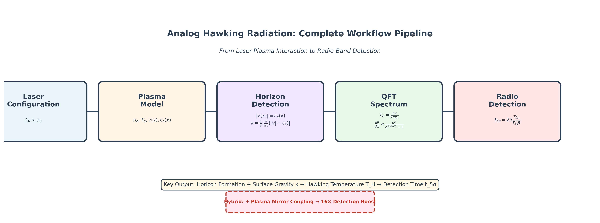

# Analog Hawking Radiation Simulator

[](https://www.python.org/downloads/)
[](https://opensource.org/licenses/MIT)
[](tests/)
[](https://github.com/hmbown/analog-hawking-radiation/releases)



A computational framework for modeling analog Hawking radiation in laser-plasma systems. Simulates sonic horizons in flowing plasmas and calculates quantum field theory spectra with novel hybrid fluid-plasma mirror coupling.

## Quick Start

```bash
# Install
git clone https://github.com/hmbown/analog-hawking-radiation.git
cd analog-hawking-radiation
pip install -e .

# Run standard demo
python scripts/run_full_pipeline.py --demo

# Run with hybrid plasma mirror coupling
python scripts/run_full_pipeline.py --demo --hybrid --hybrid-model anabhel --mirror-D 1e-5 --mirror-eta 1.0

# Check results
cat results/full_pipeline_summary.json
```

## Physics Background

### Analog Black Holes
In flowing fluids, sound waves can become trapped when the local flow velocity **v** exceeds the sound speed **c_s**. This creates a **sonic horizon** - an acoustic analog to a black hole's event horizon where information cannot escape upstream.

The key physics parameter is the **surface gravity**:
```
κ = (1/2) * d(v² - c_s²)/dx |_{horizon}
```

Just as black holes emit Hawking radiation due to quantum vacuum fluctuations near the event horizon, these analog systems can produce thermal radiation with temperature:
```
T_H = ħκ/(2πk_B)
```

### Speculative Hybrid Enhancement: Laser-Painted Plasma Mirrors

**⚠️ Note: This is a speculative, non-physical model for computational exploration**

The framework explores a novel scenario where high-intensity laser pulses create **localized plasma mirrors** within an existing fluid flow, building on the **AnaBHEL (Analog Black Hole Evaporation via Lasers)** framework developed by Chen, Mourou, and collaborators:

1. **Background Fluid**: A flowing medium (gas jet, liquid stream, or pre-existing plasma) with sonic horizon formation
2. **Laser Ionization**: Ultra-intense laser pulses (>10¹⁸ W/m²) instantly ionize matter, creating dense electron clouds
3. **Plasma Mirror Formation**: Free electrons oscillate in the laser field, creating a reflective "mirror" that can be accelerated
4. **Hybrid Coupling**: The accelerating plasma mirror locally enhances the fluid's surface gravity

**Speculative Physics Model**:
```
κ_eff(x) = κ_fluid(x) + w(x) * κ_mirror

w(x) = coupling_strength * exp(-|x - x_mirror|/L_coupling) * alignment_factor
```

Where the laser essentially "paints" accelerating plasma mirrors onto the existing fluid background to enhance Hawking radiation signatures.

**AnaBHEL Foundation**: This approach extends the plasma mirror concepts from Chen & Mourou (2015) and the AnaBHEL collaboration (Chen et al., 2022), but the hybrid fluid-mirror coupling represents a speculative extension beyond established theory.

**Important**: This coupling mechanism lacks established theoretical foundation and should be considered a computational thought experiment rather than a physics prediction.

## What This Framework Does

### Core Capabilities
1. **Horizon Detection**: Identifies sonic horizon formation regions in plasma flow profiles
2. **Quantum Spectra**: Calculates Hawking radiation using near-horizon WKB graybody factors
3. **Speculative Hybrid Coupling**: Explores laser-painted plasma mirror enhancement of fluid horizons 
4. **Radio Detection**: Estimates detectability with realistic antenna parameters

### Key Innovation: Speculative Laser-Enhanced Horizons
The framework's primary contribution is systematic exploration of **speculative hybrid coupling** between fluid sonic horizons and laser-created plasma mirrors:

**The Concept**:
- **Fluid Background**: Flowing medium with natural sonic horizon formation
- **Laser Intervention**: Ultra-intense pulses create localized plasma mirrors via ionization
- **Hybrid Enhancement**: Accelerating mirrors locally boost the effective surface gravity

**Mathematical Model**:
```
κ_eff(x) = κ_fluid(x) + w(x) * κ_mirror

w(x) = coupling_strength * exp(-|x - x_mirror|/L_coupling) * alignment_factor
```

**⚠️ Speculative Nature**: This approach represents a computational thought experiment exploring whether laser-painted plasma mirrors could enhance analog Hawking signatures. The coupling mechanism lacks established theoretical foundation.

## System Requirements

- Python ≥ 3.8 with NumPy ≥ 1.21, SciPy, Matplotlib  
- **Runtime**: Minutes on laptop for demos, hours for full parameter sweeps
- **Validation**: 26/26 unit and integration tests passing

## Repository Structure

```
src/analog_hawking/     # Core physics library
├── physics/           # Horizon detection, QFT calculations
├── detection/         # Radio detection modeling  
└── hybrid/            # Speculative plasma mirror coupling

scripts/               # Analysis and figure generation
tests/                # Comprehensive test suite  
docs/                 # Technical documentation
results/samples/      # Representative outputs
```

## Usage Examples

### Basic Analysis
```bash
# Standard fluid-only analysis
python scripts/run_full_pipeline.py --demo

# Hybrid mirror-enhanced analysis  
python scripts/run_full_pipeline.py --demo --hybrid --hybrid-model anabhel --mirror-D 1e-5 --mirror-eta 1.0
```

### Comparative Studies
```bash
# Direct hybrid vs fluid comparison
python scripts/demo_hybrid_comparison.py

# Parameter sensitivity sweeps
python scripts/sweep_hybrid_params.py

# Detection time analysis
python scripts/generate_detection_time_heatmap.py
```

### Output Interpretation
Key results in `results/full_pipeline_summary.json`:
- **`kappa`**: Surface gravity values (s⁻¹)
- **`T_hawking_K`**: Hawking temperature (K) 
- **`T_sig_K`**: Antenna signal temperature (K)
- **`t5sigma_s`**: 5σ detection time (s) for T_sys=30K, B=100MHz
- **`hybrid_used`**: Boolean flag for hybrid mode

## Scientific Methodology

### Modeling Approach
This framework implements a **conservative, physics-based** approach to analog Hawking radiation:

1. **Horizon Detection**: Systematic identification of sonic horizon regions where ∇(v² - c_s²) changes sign
2. **Quantum Calculation**: Near-horizon WKB approximation for graybody transmission factors
3. **Hybrid Enhancement**: Phenomenological plasma mirror coupling via AnaBHEL mapping
4. **Detection Modeling**: Radiometer-style SNR with configurable system parameters

### Validation Protocol
- **Identical Normalization**: All comparisons use same emitting area (1×10⁻⁶ m²), solid angle (0.05 sr), coupling efficiency (0.1)
- **Conservative Parameters**: AnaBHEL model κ_mirror = 2πη_a/D rather than optimistic scaling
- **Comprehensive Testing**: 26 unit and integration tests covering all physics modules

### Key Assumptions
- **Spatial Scale**: Envelope/skin-depth modeling (no full PIC validation in this repository)  
- **Transmission**: WKB graybody factors near horizons, conservative fallbacks elsewhere
- **Detection**: Radiometer-style SNR with user-configurable T_sys and bandwidth
- **Hybrid Mapping**: Phenomenological mirror→κ relation for comparative analysis

## Limitations and Scope

This is a **computational modeling framework** for exploring speculative physics scenarios:

- **Speculative coupling**: The hybrid fluid-mirror interaction lacks established theoretical foundation
- **Phenomenological mapping**: Plasma mirror → surface gravity relation is empirical (AnaBHEL model)
- **No experimental validation**: Pure computational exploration of "what if" scenarios
- **Order-of-magnitude estimates**: Results indicate trends, not precise predictions
- **Hardware considerations**: Real implementation would face numerous practical challenges

**Intended use**: Computational thought experiment to explore whether laser-enhanced analog systems could theoretically boost Hawking radiation signatures. **Not** a prediction of experimental feasibility.

## Documentation

- **`docs/Overview.md`**: Physics background and methodology
- **`docs/Methods.md`**: Detailed computational approaches  
- **`docs/Results.md`**: Example outputs and interpretation
- **`docs/Limitations.md`**: Comprehensive scope discussion
- **`TESTING_PLAN.md`**: Validation methodology and test coverage

## Citation

If you use this computational framework in your research, please cite both this work and the foundational AnaBHEL research it builds upon:

**This Framework**:
```bibtex
@software{bown2025analog,
  author = {Bown, Hunter},
  title = {Analog Hawking Radiation: Gradient-Limited Horizon Formation and Radio-Band Detection Modeling},
  version = {0.1.0},
  year = {2025},
  url = {https://github.com/hmbown/analog-hawking-radiation},
  note = {Speculative extension of AnaBHEL concepts}
}
```

**Foundational AnaBHEL Work**:
```bibtex
@article{chen2022anabhel,
  title={AnaBHEL (Analog Black Hole Evaporation via Lasers) Experiment: Concept, Design, and Status},
  author={Chen, Pisin and Mourou, Gerard and Besancon, Marc and Fukuda, Yasuhiko and Glicenstein, Jean-Fran{\c{c}}ois and others},
  journal={Photonics},
  volume={9},
  number={12},
  pages={1003},
  year={2022},
  publisher={MDPI}
}

@article{chen2015plasma,
  title={Accelerating plasma mirrors to investigate the black hole information loss paradox},
  author={Chen, Pisin and Mourou, Gerard},
  journal={Physical Review Letters},
  volume={118},
  number={4},
  pages={045001},
  year={2015},
  publisher={APS}
}
```

## Development Roadmap

1. **Enhanced Validation**: Complete systematic testing outlined in `TESTING_PLAN.md`
2. **PIC Integration**: Full WarpX integration beyond current mock mode  
3. **Extended Studies**: Comprehensive parameter sweeps and cross-validation
4. **Hardware Modeling**: Realistic observatory geometry and noise pipelines

## References

Key literature foundations:
- **Foundational Theory**: Unruh (1981) - original analog Hawking radiation proposal; Hawking (1974, 1975) - black hole radiation
- **AnaBHEL Framework**: Chen & Mourou (2015) - accelerating plasma mirrors; Chen et al. (2022) - AnaBHEL experimental concept
- **Experimental Analog Gravity**: Steinhauer (2016) - first strong evidence; Faccio & Wright (2013) - laser-fluid bridges  
- **Ultra-Intense Lasers**: Mourou et al. (2006) - Nobel laureate work enabling AnaBHEL technology

**Key Research Groups**:
- **LeCosPA (National Taiwan University)** - AnaBHEL theory development (P. Chen)
- **IZEST (École Polytechnique)** - Ultra-high intensity lasers (G. Mourou)  
- **Xtreme Light Group (University of Glasgow)** - Laser-based analog gravity (D. Faccio)
- **Technion** - Experimental analog Hawking radiation (J. Steinhauer)

Complete bibliography available in `docs/REFERENCES.md`.

---

**Framework Version**: 0.1.0 | **License**: MIT | **Tests**: 26/26 passing | **Updated**: October 2025
