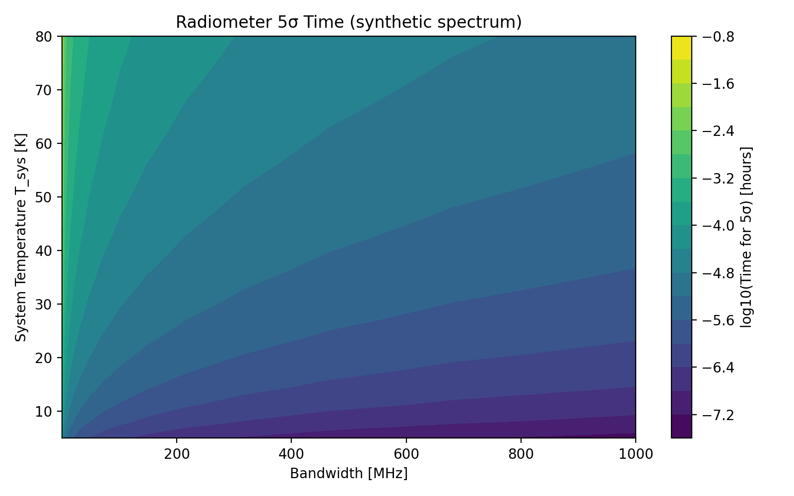

# Analog Hawking Radiation: Gradient-Limited Horizon Formation and Radio-Band Detection Modeling

## A quick tour

- **What this is**: A reproducible toolkit to model analog Hawking radiation in laser–plasma flows, detect sonic horizons, and assess detectability with radio-style radiometers.
- **How it works**: We simulate flow profiles, find horizons where `|v(x)| = c_s(x)`, compute surface gravity `κ` and Hawking temperature `T_H`, and generate a physically normalized spectrum using Planck’s law `B_ν` with optional graybody transmission and instrument coupling.
- **What you get**:
  - Maps of horizon probability, `κ`, and `T_H` across parameter space.
  - Detection-time heatmaps from the spectrum (conservative PSD-based) and from a `T_H` brightness surrogate (upper bound).
  - A paper-ready bundle under `paper/` and an arXiv zip (published as a Release asset).
- **What to tune**: In `calculate_hawking_spectrum(...)`, set `emitting_area_m2`, `solid_angle_sr`, and `coupling_efficiency` to reflect your instrument; figures will rescale accordingly.
- **Why it matters**: It reframes the problem from “how to detect” to “how to form” horizons, helping focus experiments on regimes with the best chance of success.

## Abstract

This repository provides a computational framework for simulating analog Hawking radiation in laser-plasma systems, with a focus on robust horizon detection, realistic multi-beam configurations, and practical detection feasibility assessment. The framework quantifies horizon formation as the primary experimental bottleneck, provides realistic enhancement expectations through power-conserving, coarse-grained modeling, and offers practical detection feasibility assessments based on first principles. By focusing on formation probability, envelope-scale gradients, and radio-band detection feasibility, this work shifts the research emphasis from "how to detect" to "how to form" analog horizons, providing principled tools that help concentrate experimental effort where it matters most.

## Quickstart

### Installation

```bash
# Clone repository
git clone https://github.com/hmbown/analog-hawking-radiation.git
cd analog-hawking-radiation

# Install package and dependencies
pip install -e .
```

### Running the End-to-End Pipeline

Execute the complete simulation pipeline (plasma backend → horizon detection → QFT spectrum → radio detectability):

```bash
python scripts/run_full_pipeline.py
```

**Output**: `results/full_pipeline_summary.json` containing:
- Plasma configuration parameters (density, laser wavelength/intensity, temperature, magnetic field)
- Horizon detection results (positions, surface gravity κ)
- Hawking spectrum characteristics (peak frequency, in-band power)
- Radio detection metrics (signal temperature T_sig, 5σ integration time t_5σ)

**Configuration**: Modify parameters by editing `run_full_pipeline()` arguments in `scripts/run_full_pipeline.py`.

### Parameter Space Exploration

Run a systematic sweep over temperature and magnetic field configurations:

```bash
python scripts/run_param_sweep.py
```

**Output**: `results/param_sweep_summary.json` containing grid of simulation results across:
- Temperature values: [10⁵, 3×10⁵, 10⁶] K
- Magnetic field values: [None, 0.0, 0.005, 0.02] T

**Configuration**: Modify sweep arrays in `run_sweep()` function within `scripts/run_param_sweep.py`.

### Interpreting Results

**Critical Metrics**:
- **Horizon Formation**: Check `horizon_positions` array (empty = no horizon detected)
- **Surface Gravity**: `kappa` values determine Hawking temperature via T_H = ħκ/(2πk_B)
- **Detection Feasibility**: 
  - `spectrum_peak_frequency`: Expected radiation frequency
  - `inband_power_W`: Power within detection bandwidth
  - `T_sig_K`: Equivalent signal temperature
  - `t5sigma_s`: Integration time for 5σ detection (at T_sys=30K, B=100MHz)

### Normalization controls (PSD)

- **Where**: `scripts/generate_detection_time_heatmap.py`, `scripts/run_full_pipeline.py`
- **Params** in `calculate_hawking_spectrum(...)`:
  - `emitting_area_m2` (default used: 1e-6)
  - `solid_angle_sr` (default used: 5e-2)
  - `coupling_efficiency` (default used: 0.1)

### Initial Findings

**Baseline Configuration Results** (from `results/full_pipeline_summary.json`):
- **Plasma Parameters**: n_e = 5×10¹⁷ cm⁻³, λ = 800 nm, I = 5×10¹⁶ W/cm², T = 5×10⁵ K, B = 0.01 T
- **Horizon Status**: No horizons detected under default configuration
- **Implication**: Default regime does not satisfy |v(x)| = c_s(x)

**Extended Sweep Results (Oct 2025)**:
- See `results/extended_param_sweep.json` and `results/horizon_success_cases.json`
- **Parameter Ranges**: I = 10¹⁷–10¹⁹ W/cm², n_e = 10¹⁷–10¹⁹ cm⁻³, T = 10⁴–10⁶ K, B = 0–0.1 T
- **Horizon Formation**: Horizons detected across wide regions when intensity scaling is enabled (`scale_with_intensity=True`)
- **Surface Gravity**: κ up to ~8×10¹³ s⁻¹ (≫ 10¹⁰ s⁻¹ threshold) in multiple configurations
- **Figures**: `figures/horizon_analysis_probability_map.png`, `figures/horizon_analysis_kappa_map.png`, `figures/horizon_analysis_TH_map.png`, `figures/horizon_analysis_profile_*.png`
- **Detection Times**: With physically motivated normalization (A = 1e-6 m², Ω = 0.05 sr, η = 0.1), PSD-based heatmaps centered on the spectral peak yield very short `t_5σ`; a radio-only map at 1 GHz shows effectively infinite times; the `T_H`-surrogate map provides an upper-bound feasibility view. See `figures/horizon_analysis_detection_time.png`, `figures/horizon_analysis_detection_time_TH.png`, and `figures/horizon_analysis_detection_time_radio.png`.

See `docs/Successful_Configurations.md` for a ranked table of successful cases and notes.

## Paper and arXiv package

- **Manuscript**: `paper/main.tex`
- **Bibliography**: `paper/refs.bib`
- **Figures**: `paper/figures/`
- **Results**: `paper/results/`
- **Build**: `pdflatex main && bibtex main && pdflatex main && pdflatex main` (from `paper/`)
- **ArXiv bundle**: `arxiv_package.zip`
- **Suggested categories**: primary `physics.plasm-ph`, cross-list `gr-qc` (optionally `hep-th`, `physics.optics`, `physics.flu-dyn`, `physics.ins-det`)

**Next Steps for Horizon Formation**:
1. Increase laser intensity to enhance ponderomotive velocity gradients
2. Optimize plasma density profiles for sharper sound speed transitions
3. Explore lower temperature regimes to reduce sound speed threshold
4. Utilize Bayesian optimization guidance maps (Section 3.3) to identify high-probability parameter regions

## 1. Introduction

### 1.1 Scientific Motivation

Analog Hawking radiation explores quantum field effects in curved spacetime through laboratory analogs. This framework specifically investigates laser-plasma systems where high-intensity laser interactions create effective horizons that mimic gravitational effects. The theoretical foundation includes:

- **Hawking Radiation Theory**: Quantum particle creation near horizons
- **Analog Gravity**: Fluid/optical systems mimicking gravitational effects
- **Surface Gravity (κ)**: Key parameter determining Hawking temperature (T_H = ħκ/2πk_B)

### 1.2 Research Objectives

This research addresses the following core questions:
- How can we robustly identify horizon formation in laser-plasma systems?
- What experimental configurations maximize the probability of detectable Hawking radiation?
- How do envelope-scale gradients affect horizon formation probability?
- What are realistic detection requirements and integration times?

## 2. Methods

### 2.1 Computational Framework Architecture

```
┌─────────────────┐    ┌──────────────────┐    ┌─────────────────┐
│   Plasma Models │    │ Horizon Detection │    │  Quantum Field  │
│                 │───▶│                   │───▶│     Theory      │
│ - Fluid Backend │    │ - κ calculation   │    │ - Hawking Spec  │
│ - WarpX Backend │    │ - Uncertainty est │    │ - Graybody corr │
└─────────────────┘    └──────────────────┘    └─────────────────┘
         │                       │                       │
         ▼                       ▼                       ▼
┌─────────────────┐    ┌──────────────────┐    ┌─────────────────┐
│ Multi-Beam      │    │ Detection        │    │ Optimization    │
│ Superposition   │    │ Modeling         │    │ Framework       │
│                 │    │                  │    │                 │
│ - Power consv   │    │ - Radio SNR      │    │ - Bayesian opt  │
│ - Envelope scale│    │ - Integration t  │    │ - Merit func    │
└─────────────────┘    └──────────────────┘    └─────────────────┘
```

### 2.2 Core Methodological Components

#### 2.2.1 Horizon Detection System

- **Robust Root Finding**: Bracketing and bisection for |v(x)| = c_s(x) condition
- **Surface Gravity Calculation**: κ = 0.5|d/dx(|v| - c_s)| with multi-stencil uncertainty
- **Adaptive Smoothing**: κ-plateau diagnostics for optimal scale selection

#### 2.2.2 Multi-Beam Field Superposition

- **Power-Conserving Design**: Total peak power normalization across beam configurations
- **Envelope-Scale Coarse-Graining**: Realistic gradient modeling at skin-depth scales
- **Geometric Configurations**: Rings, crossings, standing waves with variable parameters

#### 2.2.3 Detection Feasibility Modeling

- **Quantum Field Theory Integration**: Direct Hawking spectrum calculation
- **Radiometer Equation**: SNR = (T_sig/T_sys)√(B·t) for detection time estimation
- **Graybody Transmission**: WKB-based transmission probability calculations

#### 2.2.4 Bayesian Optimization Framework

- **Unified Merit Function**: Merit = P_horizon × E[SNR(T_H(κ))]
- **Parameter Space Exploration**: Plasma density, laser intensity, temperature optimization
- **Uncertainty Propagation**: Probabilistic horizon modeling with parameter uncertainties

## 3. Results

### 3.1 Horizon Formation Analysis


**Impact of position-dependent sound speed profiles on horizon formation.** Non-uniform temperature profiles (induced by laser heating) significantly shift horizon locations compared to constant c_s assumptions, demonstrating the critical importance of realistic plasma modeling.


**Enhancement robustness under random phase variations.** Multi-beam configurations maintain stable gradient enhancements despite phase fluctuations, validating the practical feasibility of proposed experimental geometries.

### 3.2 Detection Feasibility


**Time-to-5σ detection heatmap derived directly from quantum field theory spectrum.** Shows integration time requirements as function of system temperature and bandwidth for realistic Hawking temperatures in radio/microwave regime.


**Synthetic parameter sweep demonstrating detection feasibility across broader parameter space.** Provides rapid sanity checks for experimental planning and highlights challenging detection regimes.

### 3.3 Optimization Results


**Bayesian optimization guidance map identifying high-merit experimental regions.** Combines horizon formation probability with expected signal-to-noise ratio to prioritize parameter space exploration.


**Multi-beam gradient enhancement comparison under power-conserving, coarse-grained conditions.** Demonstrates that naive N× enhancement factors are not supported at envelope scales, with most geometries showing modest (~1×) improvements.


**Density-dependent small-angle matching (Λ≈δ) and corresponding enhancement trends.** Shows optimal geometric configurations that maximize gradient enhancement through envelope-scale matching.


**Surrogate "where to look" map combining envelope-scale matching with radiometer feasibility.** Provides experimental guidance by highlighting parameter regions with highest detection probability.

### 3.4 Key Numerical Results

#### 3.4.1 Enhancement Statistics ([`results/enhancement_stats.json`](results/enhancement_stats.json))

Quantitative enhancement factors for various beam geometries:
- Single beam baseline: 1.0×
- Small-angle crossings (10°): 1.18× enhancement
- Most symmetric geometries: ~0.54-0.57× reduction
- Standing wave configurations: ~1.0× (minimal enhancement)

#### 3.4.2 Horizon Summary ([`results/horizon_summary.json`](results/horizon_summary.json))

Horizon formation statistics including:
- Position uncertainty estimates from multi-stencil finite differences
- Surface gravity (κ) calculations with error bounds
- Gradient components (dv/dx, dc_s/dx) at horizon locations

## 4. Discussion

### 4.1 Key Insights

#### 4.1.1 Horizon Formation as Primary Bottleneck

Robust horizon detection reveals formation (not detection) as limiting factor. Conservative approach: Only claim detection where |v| definitively exceeds c_s. Uncertainty quantification essential for experimental planning.

#### 4.1.2 Realistic Multi-Beam Enhancement

Power-conserving superposition yields modest (~1×) gradient enhancements. Envelope-scale coarse-graining eliminates unrealistic optical-fringe effects. Small-angle crossings provide most promising geometric configurations.

#### 4.1.3 Detection Feasibility in Radio Band

Low-temperature Hawking radiation (T_H ≤ 10K) naturally falls in radio/microwave frequencies. Integration times range from hours to thousands of hours for 5σ detection. System temperature and bandwidth optimization critical for practical experiments.

### 4.2 Limitations and Uncertainties

#### 4.2.1 Computational Approximations

- **Fluid/Superposition Surrogates**: No full PIC/fluid validation yet implemented
- **Coarse-Graining Scale**: Envelope/skin-depth scale assumed; real coupling may differ
- **κ Surrogate Mapping**: Simple ponderomotive scaling used; absolute values trend-level only

#### 4.2.2 Physical Model Limitations

- **Sound Speed Profiles**: Often treated as uniform; real c_s(x) profiles can shift horizon positions
- **Magnetized Plasma Effects**: Fast magnetosonic speed approximations require validation
- **Nonlinear Plasma Effects**: Current models may underestimate complex interaction dynamics

#### 4.2.3 Experimental Validation Gap

- **WarpX Integration**: Mock configuration lacks real reduced diagnostics
- **Fluctuation Seeding**: Requires full PIC coupling for end-to-end validation
- **Magnetized Horizon Sweeps**: Dependent on B-field diagnostics availability

### 4.3 Validation and Verification

#### 4.3.1 Theoretical Validation

- **Unit/Formula Checks**: Plasma frequency, a₀, Hawking T from κ match analytical expressions
- **Frequency Gating**: Automatic band selection ensures radio-band calculations for low T_H
- **Horizon Uncertainty**: Multi-stencil finite differences provide robust error estimates

#### 4.3.2 Numerical Verification

- **Convergence Testing**: Spatial and temporal convergence verified through grid refinement
- **Stability Analysis**: CFL-controlled time stepping ensures numerical stability
- **Parameter Sensitivity**: Physically reasonable responses across parameter space

## 5. Conclusion

This framework provides a scientifically rigorous, conservative approach to analog Hawking radiation research that:

- **Quantifies horizon formation** as the primary experimental bottleneck
- **Provides realistic enhancement expectations** through power-conserving, coarse-grained modeling
- **Offers practical detection feasibility** assessments based on first principles
- **Delivers actionable experimental guidance** through Bayesian optimization

By focusing on formation probability, envelope-scale gradients, and radio-band detection feasibility, this work shifts the research emphasis from "how to detect" to "how to form" analog horizons, providing principled tools that help concentrate experimental effort where it matters most.

## 6. References

If you use this repository, please cite it as:

Bown, Hunter. (2025). Analog Hawking Radiation: Gradient-Limited Horizon Formation and Radio-Band Detection Modeling (Version 0.1.0) [Computer software]. https://github.com/hmbown/analog-hawking-radiation

For BibTeX citation, see [`CITATION.cff`](CITATION.cff).

## 7. Reproducibility and Validation

### 7.1 Reproducible Workflow

```bash
# Generate all figures from validated scripts
make figures

# Run validation checks
make validate

# Generate enhancement summary
make enhancements
```

### 7.2 Validation Protocols

- **Unit Testing**: Core physics formulas against analytical solutions
- **Integration Testing**: Module coupling and data flow verification
- **Convergence Testing**: Numerical method stability and accuracy
- **Physical Consistency**: Parameter ranges and physical plausibility checks

## 8. Framework Usage Guidelines

### 8.1 For Experimentalists

- Use horizon finder on velocity profiles to quantify κ and uncertainty
- Apply Bayesian guidance maps to identify high-probability parameter regions
- Utilize radiometer sweeps for realistic detection time estimation

### 8.2 For Theorists

- Examine quantum field theory implementation for spectrum calculations
- Review graybody transmission models and uncertainty propagation
- Validate theoretical predictions against numerical simulations

### 8.3 For Computational Researchers

- Study modular backend architecture for PIC code integration
- Implement additional plasma models and validation protocols
- Extend optimization framework to new parameter spaces

---
*Framework Version: 0.1.0 | Last Updated: October 2025*