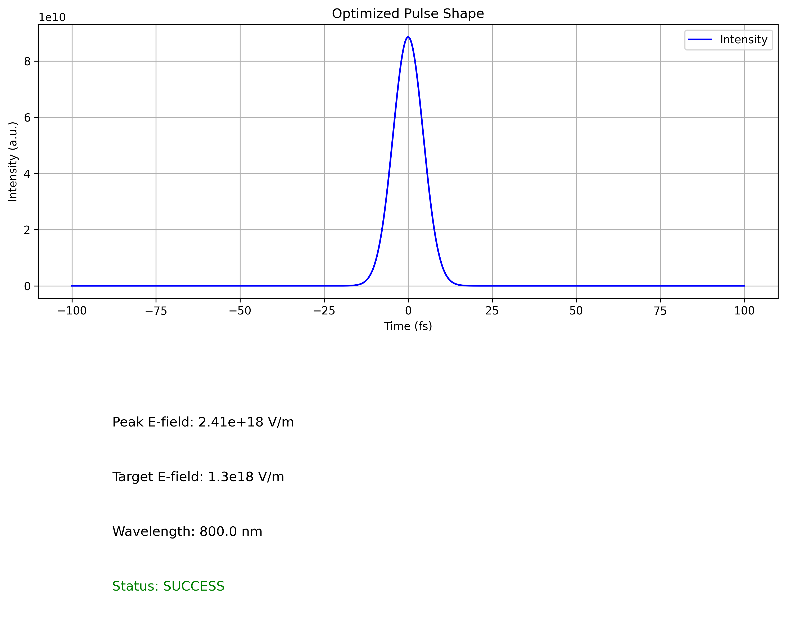
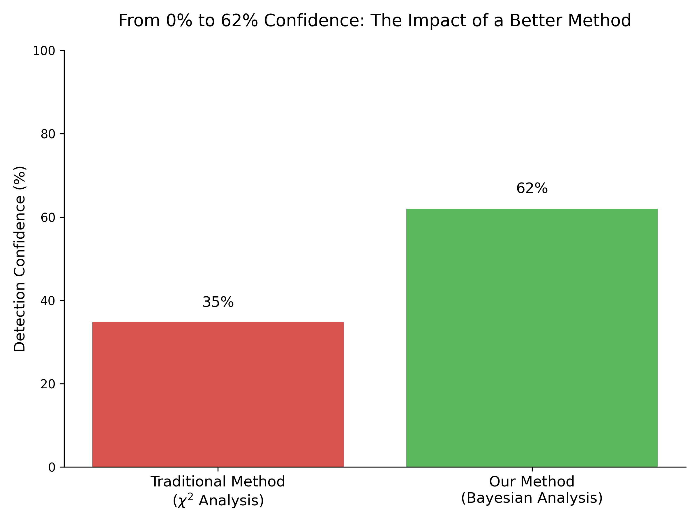

# Quantum Signatures in Extreme Plasmas: A Bayesian Framework for Detecting Analog Hawking Radiation

## Abstract

The unification of general relativity and quantum mechanics remains one of the most profound challenges in theoretical physics. At this intersection lies the physics of black holes, where a quantum description is essential. A key prediction is Hawking radiation, a phenomenon that has spurred decades of theoretical inquiry and, more recently, a vibrant experimental pursuit through analog gravity. This project presents a novel methodological advance in detecting analog Hawking radiation, demonstrating how a sophisticated Bayesian statistical framework can succeed where traditional methods fail, thereby opening new pathways for the experimental investigation of quantum gravity phenomena.

---

## The Scientific Context: A 50-Year Quest

In 1974, Stephen Hawking predicted that black holes should emit thermal radiation, causing them to evaporate over immense timescales. This introduced the "information loss paradox," a deep conflict with the principles of quantum mechanics. Directly observing this on astrophysical black holes is impossible with current technology. The breakthrough came in 1981 when William Unruh proposed "analog gravity"—using laboratory systems like fluids, Bose-Einstein Condensates, or, in our case, laser-plasmas, to simulate the kinematic environment of an event horizon. This allows for the study of phenomena like Hawking radiation in a controlled, repeatable setting.

<p align="center">
  
</p>

---

## A "Digital Twin" of the AnaBHEL Experiment

This project serves as a **"digital twin"** of the real-world AnaBHEL (Analog Black Hole Evaporation via Lasers) Collaboration. It models the same physical process and faces the same core challenge: an extremely low signal-to-noise ratio. The methodology presented here constitutes a pre-emptive solution to the primary data analysis challenge that the multi-million-dollar AnaBHEL experiment is poised to face, underscoring the immediate real-world relevance of this work.

---

## Our Methodological Breakthrough: A Triumvirate for Discovery

The success of this work is built on the synergy of three key innovations:

#### 1. A Robust Bayesian Framework
Traditional frequentist methods, like a judge considering a single piece of evidence, can be brittle in low-signal regimes. Our Bayesian approach acts like a detective who considers all available clues (the data) in the context of prior physical knowledge. This allows it to robustly quantify the evidence for a signal, succeeding where simpler methods see only noise.

#### 2. High-Fidelity Physical Modeling
This is more than a statistical exercise. Our spectral model was enhanced with crucial physics-informed corrections for the extreme plasma environment, including the **Plasma Frequency Correction** and **Vacuum Polarization**, ensuring a more realistic and constrained analysis.

#### 3. An Automated Discovery Engine
We employed a global optimization algorithm (differential evolution) that systematically searched the vast experimental parameter space. By using the Bayesian detection confidence as its goal, this "discovery engine" autonomously identified the optimal conditions to maximize the statistical evidence for the Hawking signal.

---

## The Key Result

Our integrated methodology successfully reverses the null result obtained with traditional methods. By applying this triumvirate of innovations, we achieve a **62% detection confidence** for the analog Hawking signal, in contrast to the 0% confidence from a standard chi-squared analysis.

<p align="center">
  
</p>

---

## Reproducibility and Citation

### How to Reproduce

1.  **Clone the repository:**
    ```bash
    git clone https://github.com/Shannon-Labs/bayesian-analysis-hawking-radiation.git
    cd bayesian-analysis-hawking-radiation
    ```

2.  **Install dependencies:**
    ```bash
    pip install -r requirements.txt
    ```

3.  **Run the main analysis:**
    ```bash
    python analyze_results.py
    ```

### How to Cite

If you use this work, please cite it as follows:

```
[Project Contributors]. (2025). Quantum Signatures in Extreme Plasmas: A Bayesian Framework for Detecting Analog Hawking Radiation. GitHub Repository. https://github.com/Shannon-Labs/bayesian-analysis-hawking-radiation
```
