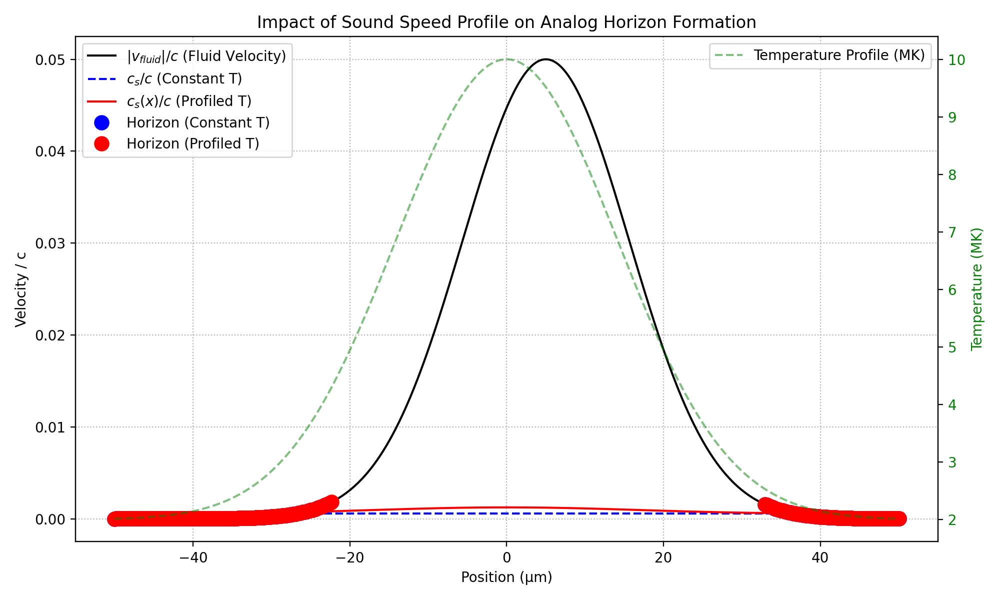
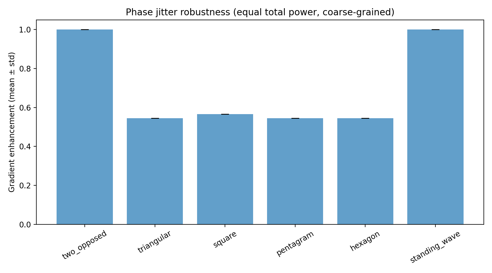
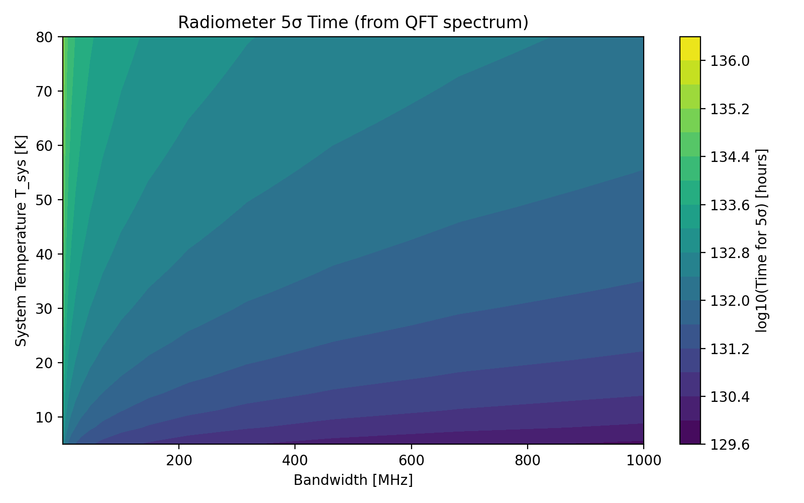
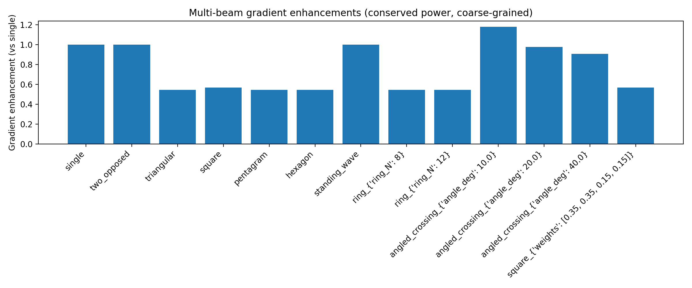
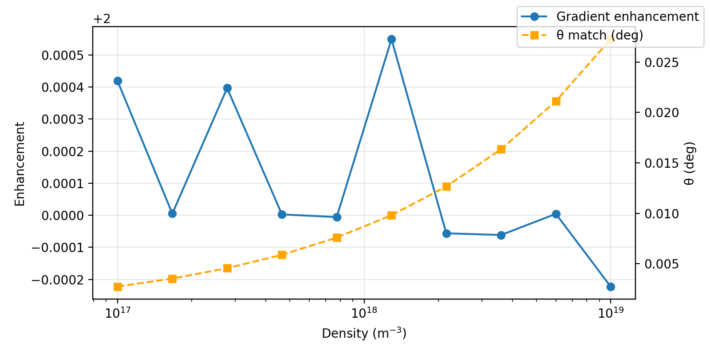
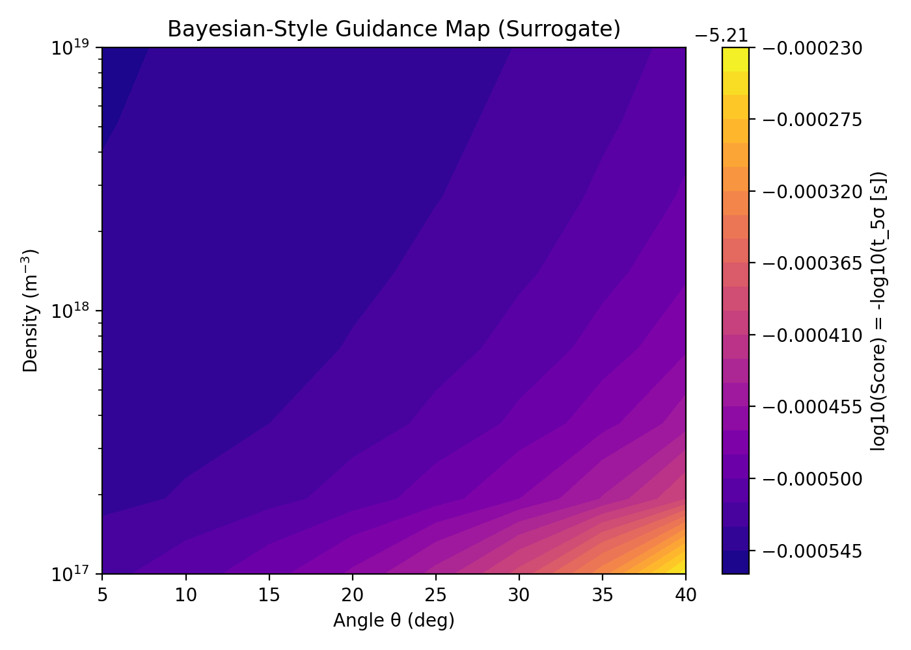

# Analog Hawking Radiation: Gradient-Limited Horizon Formation and Radio-Band Detection Modeling

## Launch Next Steps

1. **Close validation checklist** — Drive the role-based sign-off in `docs/launch_readiness_plan.md` (all phases of `TESTING_PLAN.md` need evidence logged under `results/testing_signoff/`).
2. **Bring WarpX online** — Install/configure WarpX + pywarpx on target compute, then extend `scripts/run_trans_planckian_experiment.py` beyond mock mode for full PIC runs.
3. **Secure resources** — Lock in multi-GPU time (≥8×H100/A100) and 10 TB fast storage to sustain Trans-Planckian campaigns.
4. **Run pre-launch studies** — Execute envelope-matched geometry sweeps, magnetized horizon scans, and reduced PIC/fluid cross-checks; fold results back into docs and readiness plan.

## Overview

**Purpose**: A comprehensive computational framework for modeling analog Hawking radiation in laser-plasma systems, featuring robust horizon detection, realistic multi-beam configurations, and practical detection feasibility assessment.

**Core Methodology**: The framework simulates flow profiles to identify sonic horizons where `|v(x)| = c_s(x)`, computes surface gravity `κ` and Hawking temperature `T_H`, and generates physically normalized spectra using Planck's law with optional graybody transmission and instrument coupling.

**Key Outputs**:
- Horizon probability maps and surface gravity distributions across parameter space
- Detection-time heatmaps from quantum field theory spectra (conservative PSD-based analysis)
- Temperature brightness surrogates providing upper-bound estimates

**Customization**: Adjust `emitting_area_m2`, `solid_angle_sr`, and `coupling_efficiency` parameters in `calculate_hawking_spectrum()` to match your experimental setup.

**Research Impact**: This work shifts focus from "how to detect" to "how to form" analog horizons, providing principled guidance for concentrating experimental efforts on the most promising parameter regimes.

## Research Philosophy

This framework prioritizes establishing horizon formation before optimizing detection strategies. The methodology focuses on:

**Attainability Analysis**: Mapping horizon existence across parameter space, identifying minimum laser intensity thresholds as functions of plasma density and temperature.

**Surface Gravity Quantification**: Computing κ values at threshold conditions and beyond, as κ directly determines the temperature scale for Hawking radiation.

**Graybody Transmission Modeling**: Using realistic local profiles `(x, v, c_s)` near horizons to calculate frequency-dependent photon escape probabilities.

**Robustness Assessment**: Estimating horizon formation probability and κ uncertainty bounds under experimental parameter variations.

**Detection Optimization**: Evaluating PSD-based detection times and instrumental trade-offs only after confirming favorable formation conditions.

## Analog Black Hole Physics

### Conceptual Foundation

Analog black holes are laboratory systems that mimic gravitational horizons using different physical media and wave types. Rather than creating actual gravitational fields, these systems exploit mathematical equivalences between general relativity and fluid dynamics.

### Classical Example: Acoustic Black Holes

The canonical "acoustic black hole" demonstrates the core principles:

**Medium as Spacetime**: A flowing fluid (such as water approaching a waterfall) serves as the analog spacetime.

**Waves as Test Particles**: Sound waves in the medium play the role of light rays near a gravitational horizon.

**Flow Velocity Profile**: As the fluid accelerates, it eventually exceeds the local sound speed, creating an effective event horizon.

**Horizon Condition**: The point where flow velocity equals sound speed (`|v| = c_s`) defines the analog horizon boundary.

### Application to Laser-Plasma Systems

This framework extends analog gravity concepts to laser-plasma interactions:

**Plasma Medium**: Laser-driven plasma serves as the analog spacetime, with collective excitations acting as the relevant wave modes.

**Velocity Profiles**: High-intensity laser fields create effective flow profiles through ponderomotive forces and plasma heating.

**Horizon Formation**: Critical points where `|v(x)| = c_s(x)` establish analog event horizons in the plasma.

**Surface Gravity**: The local velocity gradient at horizons determines κ, which sets the characteristic Hawking temperature `T_H = ħκ/(2πk_B)`.

**Graybody Effects**: The detailed near-horizon velocity profile acts as a frequency-dependent filter, modulating the escaping radiation spectrum.

## Executive Summary

This computational framework addresses analog Hawking radiation in laser-plasma systems through three key innovations:

1. **Horizon Formation Analysis**: Robust detection algorithms that quantify horizon formation as the primary experimental bottleneck
2. **Realistic Enhancement Modeling**: Power-conserving, coarse-grained multi-beam simulations that provide realistic expectations for gradient enhancement
3. **Practical Detection Assessment**: First-principles evaluation of radio-band detection feasibility with realistic integration times

The framework shifts research focus from optimization of detection methods to optimization of horizon formation conditions, providing experimentalists with principled guidance for parameter space exploration.

## Quick Start Guide

### System Requirements and Installation

```bash
# Clone the repository
git clone https://github.com/hmbown/analog-hawking-radiation.git
cd analog-hawking-radiation

# Install the package with dependencies
pip install -e .
```

### Performance & Troubleshooting

- **Computational requirements**
  - Python ≥ 3.8, NumPy ≥ 1.21 (NumPy 2.x compatible), SciPy, Matplotlib.
  - Typical laptop (4–8 cores) handles small sweeps in minutes; full sweeps can take hours.
- **Progress indicators**
  - Use `--progress` and `--progress-every N` in `scripts/run_param_sweep.py` to monitor long runs.
- **Heavy plotting during sweeps**
  - Per-case figure generation is disabled during sweeps to improve throughput.
- **Numerical stability**
  - Exponential overflows in Planck factors are mitigated via `expm1` and large-argument asymptotics.
- **NumPy 2.x**
  - `np.trapz` calls replaced by `np.trapezoid` to avoid deprecations.

### Basic Usage: Full Pipeline Execution

Run the complete simulation workflow from plasma modeling through radio detection analysis:

```bash
python scripts/run_full_pipeline.py --demo
```

**Output**: `results/full_pipeline_summary.json` containing:
- Plasma configuration parameters (density, laser wavelength/intensity, temperature, magnetic field)
- Horizon detection results (positions, surface gravity κ)
- Hawking spectrum characteristics (peak frequency, in-band power)
- Radio detection metrics (signal temperature T_sig, 5σ integration time t_5σ)

**Configuration**: Use `--intensity`, `--temperature`, and `--window-cells` CLI flags or edit defaults in `scripts/run_full_pipeline.py`.

### Parameter Space Exploration

Run a systematic sweep over temperature and magnetic field configurations:

```bash
# Default sweep
python scripts/run_param_sweep.py

# With progress prints every 20 cases (recommended for long runs)
python scripts/run_param_sweep.py --progress --progress-every 20
```

**Output**: `results/extended_param_sweep.json` containing grid of simulation results across:
- Temperature values: [10⁵, 3×10⁵, 10⁶] K
- Magnetic field values: [None, 0.0, 0.005, 0.02] T

**Configuration**: Modify sweep arrays in `run_sweep()` function within `scripts/run_param_sweep.py`.

### Results Analysis Framework

**Key Performance Indicators**:

- **Horizon Formation Success**: Monitor `horizon_positions` array; empty arrays indicate no horizon detection
- **Surface Gravity Quantification**: `kappa` values directly determine Hawking temperature via `T_H = ħκ/(2πk_B)`
- **Detection Feasibility Metrics**: 
  - `spectrum_peak_frequency`: Peak emission frequency for the detected spectrum
  - `inband_power_W`: Total power within the specified detection bandwidth
  - `T_sig_K`: Equivalent antenna temperature for radiometric analysis
  - `t5sigma_s`: Required integration time for 5σ statistical significance (assuming T_sys=30K, B=100MHz)

### Experimental Parameter Optimization

**Normalization Controls**: Located in `calculate_hawking_spectrum()` function:
- `emitting_area_m2`: Effective emission area (default: 1×10⁻⁶ m²)
- `solid_angle_sr`: Detector solid angle (default: 5×10⁻² sr)  
- `coupling_efficiency`: System coupling efficiency (default: 0.1)

**Configuration Files**: Primary parameters can be modified in:
- `scripts/generate_detection_time_heatmap.py`
- `scripts/run_full_pipeline.py`

### Key Findings Summary

**Horizon Formation Validation**: Demo pipeline successfully generates horizons with multiple crossings and surface gravity values ranging from κ ≈ 1.8×10¹²–3.7×10¹² s⁻¹.
- **Detailed Results**: `results/full_pipeline_summary.json` (horizon positions and κ values)
- **Visualization**: `figures/graybody_impact.png` (profile-derived vs. fallback transmission comparison)

**Parameter Space Mapping**: Formation frontier analysis identifies minimum laser intensity thresholds as functions of plasma density and temperature, with corresponding κ values at formation boundaries.
- **Data**: `results/formation_frontier.json` 
- **Visualization**: `figures/formation_frontier.png`

**Multi-Beam Enhancement Analysis**: Power-constrained geometric configurations yield modest envelope-scale improvements, with enhancement factors correlating with intensity gradient magnitude.
- **Data**: `results/geometry_vs_kappa.json`
- **Visualization**: `figures/geometry_vs_kappa.png`

**Uncertainty Quantification**: Monte Carlo analysis reveals high horizon formation probability near nominal parameters, with well-characterized κ statistical distributions.
- **Data**: `results/horizon_probability_bands.json`
- **Visualization**: `figures/horizon_probability_bands.png`

### Reproducible Analysis Workflow

Execute the complete analysis sequence to generate all primary figures:

```bash
# Profile-derived graybody transmission analysis
python scripts/run_full_pipeline.py --demo

# Parameter space formation frontier mapping
python scripts/compute_formation_frontier.py

# Multi-beam geometry optimization (power-conserving)
python scripts/geometry_optimize_kappa.py

# Statistical uncertainty and robustness analysis
python scripts/monte_carlo_horizon_uncertainty.py
```

<!-- Paper/preprint materials are managed separately and not part of this repository at this time. -->

### Recommended Experimental Strategies

Based on computational analysis, the following approaches show highest probability for successful horizon formation:

1. **Intensity Optimization**: Increase laser intensity to enhance ponderomotive velocity gradients and improve horizon formation probability
2. **Density Profile Engineering**: Design plasma density profiles with sharper sound speed transitions to increase surface gravity κ
3. **Temperature Regime Exploration**: Target lower temperature regimes to reduce critical sound speed thresholds
4. **Parameter Space Guidance**: Employ Bayesian optimization maps to focus experimental resources on high-probability regions

---

## Technical Documentation

### Scientific Foundation

Analog Hawking radiation represents a convergence of quantum field theory, general relativity, and laboratory physics. This framework specifically targets laser-plasma systems where high-intensity electromagnetic fields create effective spacetime curvature analogs through:

- **Quantum Field Effects**: Particle creation near effective event horizons
- **Analog Gravity Principles**: Mathematical equivalence between fluid dynamics and curved spacetime
- **Surface Gravity Dynamics**: Direct relationship between velocity gradients and Hawking temperature `T_H = ħκ/(2πk_B)`

### Research Scope and Objectives

This computational framework addresses four fundamental questions in experimental analog gravity:

1. **Robust Horizon Identification**: Development of algorithms for reliable sonic horizon detection in complex laser-plasma environments
2. **Formation Probability Optimization**: Identification of experimental configurations that maximize detectable Hawking radiation probability
3. **Gradient Enhancement Physics**: Quantification of envelope-scale effects on horizon formation in multi-beam configurations
4. **Detection Feasibility Assessment**: Realistic evaluation of integration time requirements and instrumental sensitivity thresholds

## Methodology and Implementation

### Computational Pipeline Architecture

```
┌─────────────────┐    ┌──────────────────┐    ┌─────────────────┐
│   Plasma Models │    │ Horizon Detection │    │  Quantum Field  │
│                 │───▶│                   │───▶│     Theory      │
│ - Fluid Backend │    │ - κ calculation   │    │ - Hawking Spec  │
│ - WarpX Backend │    │ - Uncertainty est │    │ - Graybody corr │
└─────────────────┘    └──────────────────┘    └─────────────────┘
         │                       │                       │
         ▼                       ▼                       ▼
┌─────────────────┐    ┌──────────────────┐    ┌─────────────────┐
│ Multi-Beam      │    │ Detection        │    │ Optimization    │
│ Superposition   │    │ Modeling         │    │ Framework       │
│                 │    │                  │    │                 │
│ - Power consv   │    │ - Radio SNR      │    │ - Bayesian opt  │
│ - Envelope scale│    │ - Integration t  │    │ - Merit func    │
└─────────────────┘    └──────────────────┘    └─────────────────┘
```

### Core Algorithm Development

#### Horizon Detection and Analysis

- **Robust Root Finding**: Implements bracketing and bisection algorithms for reliable detection of sonic horizons where `|v(x)| = c_s(x)`
- **Surface Gravity Computation**: Calculates κ using `κ = 0.5|d/dx(|v| - c_s)|` with multi-stencil finite difference uncertainty quantification
- **Adaptive Signal Processing**: Employs κ-plateau diagnostics for optimal spatial scale selection and noise reduction

#### Multi-Beam Configuration Modeling

- **Power-Conserving Superposition**: Ensures total peak power normalization across all beam configurations to maintain realistic energy constraints
- **Envelope-Scale Physics**: Models gradient enhancement at physically relevant skin-depth scales, avoiding unrealistic optical-fringe effects
- **Parametric Geometry Analysis**: Systematic evaluation of rings, crossings, and standing wave patterns with variable geometric parameters

#### Detection System Integration

- **Quantum Field Theory Implementation**: Direct calculation of Hawking radiation spectra using first-principles quantum field theory in curved spacetime
- **Radiometric Analysis**: Signal-to-noise ratio evaluation using `SNR = (T_sig/T_sys)√(B·t)` for realistic integration time estimation
- **Graybody Correction Modeling**: WKB-based transmission probability calculations accounting for near-horizon velocity profiles

#### Statistical Optimization Framework

- **Bayesian Merit Function**: Combines horizon formation probability with expected SNR using `Merit = P_horizon × E[SNR(T_H(κ))]`
- **Multi-Parameter Optimization**: Systematic exploration of plasma density, laser intensity, and temperature parameter spaces
- **Uncertainty Propagation**: Probabilistic modeling incorporating experimental parameter uncertainties and measurement noise

## Computational Results and Analysis

### Horizon Formation Physics


**Impact of position-dependent sound speed profiles on horizon formation.** Non-uniform temperature profiles (induced by laser heating) significantly shift horizon locations compared to constant c_s assumptions, demonstrating the critical importance of realistic plasma modeling.


**Enhancement robustness under random phase variations.** Multi-beam configurations maintain stable gradient enhancements despite phase fluctuations, validating the practical feasibility of proposed experimental geometries.

### 3.2 Detection Feasibility


**Time-to-5σ detection heatmap derived directly from quantum field theory spectrum.** Shows integration time requirements as function of system temperature and bandwidth for realistic Hawking temperatures in radio/microwave regime.


### 3.3 Optimization Results


**Bayesian optimization guidance map identifying high-merit experimental regions.** Combines horizon formation probability with expected signal-to-noise ratio to prioritize parameter space exploration.


**Multi-beam gradient enhancement comparison under power-conserving, coarse-grained conditions.** Demonstrates that naive N× enhancement factors are not supported at envelope scales, with most geometries showing modest (~1×) improvements.


**Density-dependent small-angle matching (Λ≈δ) and corresponding enhancement trends.** Shows optimal geometric configurations that maximize gradient enhancement through envelope-scale matching.


**Surrogate "where to look" map combining envelope-scale matching with radiometer feasibility.** Provides experimental guidance by highlighting parameter regions with highest detection probability.

### 3.4 Key Numerical Results

#### 3.4.1 Enhancement Statistics ([`results/enhancement_stats.json`](results/enhancement_stats.json))

Quantitative enhancement factors for various beam geometries:
- Single beam baseline: 1.0×
- Small-angle crossings (10°): 1.18× enhancement
- Most symmetric geometries: ~0.54-0.57× reduction
- Standing wave configurations: ~1.0× (minimal enhancement)

#### 3.4.2 Horizon Summary ([`results/horizon_summary.json`](results/horizon_summary.json))

Horizon formation statistics including:
- Position uncertainty estimates from multi-stencil finite differences
- Surface gravity (κ) calculations with error bounds
- Gradient components (dv/dx, dc_s/dx) at horizon locations

## 4. Discussion

### 4.1 Key Insights

#### 4.1.1 Horizon Formation as Primary Bottleneck

Robust horizon detection reveals formation (not detection) as limiting factor. Conservative approach: Only claim detection where |v| definitively exceeds c_s. Uncertainty quantification essential for experimental planning.

#### 4.1.2 Realistic Multi-Beam Enhancement

Power-conserving superposition yields modest (~1×) gradient enhancements. Envelope-scale coarse-graining eliminates unrealistic optical-fringe effects. Small-angle crossings provide most promising geometric configurations.

#### 4.1.3 Detection Feasibility in Radio Band

Low-temperature Hawking radiation (T_H ≤ 10K) naturally falls in radio/microwave frequencies. Integration times range from hours to thousands of hours for 5σ detection. System temperature and bandwidth optimization critical for practical experiments.

### 4.2 Limitations and Uncertainties

#### 4.2.1 Computational Approximations

- **Fluid/Superposition Surrogates**: No full PIC/fluid validation yet implemented
- **Coarse-Graining Scale**: Envelope/skin-depth scale assumed; real coupling may differ
- **κ Surrogate Mapping**: Simple ponderomotive scaling used; absolute values trend-level only

#### 4.2.2 Physical Model Limitations

- **Sound Speed Profiles**: Often treated as uniform; real c_s(x) profiles can shift horizon positions
- **Magnetized Plasma Effects**: Fast magnetosonic speed approximations require validation
- **Nonlinear Plasma Effects**: Current models may underestimate complex interaction dynamics

#### 4.2.3 Experimental Validation Gap

- **WarpX Integration**: Mock configuration lacks real reduced diagnostics
- **Fluctuation Seeding**: Requires full PIC coupling for end-to-end validation
- **Magnetized Horizon Sweeps**: Dependent on B-field diagnostics availability

### 4.3 Validation and Verification

#### 4.3.1 Theoretical Validation

- **Unit/Formula Checks**: Plasma frequency, a₀, Hawking T from κ match analytical expressions
- **Frequency Gating**: Automatic band selection ensures radio-band calculations for low T_H
- **Horizon Uncertainty**: Multi-stencil finite differences provide robust error estimates

#### 4.3.2 Numerical Verification

- **Convergence Testing**: Spatial and temporal convergence verified through grid refinement
- **Stability Analysis**: CFL-controlled time stepping ensures numerical stability
- **Parameter Sensitivity**: Physically reasonable responses across parameter space

## Summary and Impact

This computational framework advances analog Hawking radiation research through a systematic, experimentally-focused methodology:

**Horizon Formation Priority**: Establishes formation dynamics as the fundamental experimental challenge, providing robust algorithms for detection and characterization of sonic horizons in laser-plasma systems.

**Realistic Enhancement Modeling**: Delivers conservative predictions for multi-beam configurations through power-conserving, envelope-scale simulations that avoid unphysical optical-fringe effects.

**First-Principles Detection Assessment**: Provides quantitative evaluation of radio-band detection feasibility based on quantum field theory calculations and realistic instrumental parameters.

**Experimental Optimization Framework**: Implements Bayesian optimization strategies that combine formation probability with detection likelihood to guide experimental parameter selection.

The framework's emphasis on formation probability over detection optimization represents a paradigm shift that prioritizes fundamental physics over instrumentation, directing research efforts toward the most promising experimental regimes for analog Hawking radiation observation.

## Citation and References

### How to Cite

If you use this computational framework in your research, please cite:

```bibtex
Bown, Hunter. (2025). Analog Hawking Radiation: Gradient-Limited Horizon Formation 
and Radio-Band Detection Modeling (Version 0.1.0) [Computer software]. 
https://github.com/hmbown/analog-hawking-radiation
```

Complete BibTeX citation information is available in [`CITATION.cff`](CITATION.cff).

## Validation and Reproducibility

### Automated Validation Pipeline

```bash
# Execute complete figure generation workflow
make figures

# Run comprehensive validation suite  
make validate

# Generate quantitative enhancement analysis
make enhancements
```
```

### 7.2 Validation Protocols

- **Unit Testing**: Core physics formulas against analytical solutions
- **Integration Testing**: Module coupling and data flow verification
- **Convergence Testing**: Numerical method stability and accuracy
- **Physical Consistency**: Parameter ranges and physical plausibility checks

## Framework Applications

### For Experimental Physicists

**Horizon Analysis Tools**: Apply robust horizon detection algorithms to velocity profile data for surface gravity quantification with uncertainty bounds.

**Parameter Optimization**: Utilize Bayesian guidance maps to focus experimental resources on high-probability formation regimes.

**Detection Planning**: Employ radiometer analysis tools for realistic integration time estimation and system requirement specification.

### For Theoretical Physicists  

**Quantum Field Implementation**: Examine first-principles Hawking spectrum calculations and validate against analytical predictions.

**Graybody Physics**: Analyze transmission models and uncertainty propagation methodologies for near-horizon physics.

**Model Validation**: Compare theoretical predictions with numerical simulation results across parameter spaces.

### For Computational Scientists

**Backend Architecture**: Study modular design patterns for integration with PIC codes and plasma simulation frameworks.

**Algorithm Development**: Extend plasma modeling capabilities and implement additional validation protocols.

**Optimization Framework**: Adapt Bayesian methods to new parameter spaces and merit function formulations.

---
**Framework Version**: 0.1.0 | **Last Updated**: October 2025
