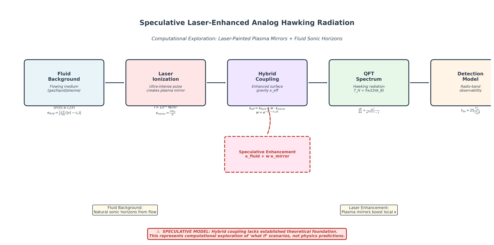

# Analog Hawking Radiation: Gradient-Limited Horizon Formation and Radio-Band Detection Modeling

[](https://www.python.org/downloads/)
[](https://opensource.org/licenses/MIT)
[](tests/)
[](https://github.com/hmbown/analog-hawking-radiation/releases)
[](https://zenodo.org)



---

## TL;DR

- **What**: A reproducible modeling toolkit for analog Hawking radiation in laser–plasma flows.
- **Focus**: Horizon identification, spectra, and radio-band detectability. Includes an optional hybrid fluid–mirror coupling model to explore configuration space.
- **Run a demo**:

```bash
pip install -e .
python scripts/run_full_pipeline.py --demo --hybrid --hybrid-model anabhel --mirror-D 1e-5 --mirror-eta 1.0
cat results/full_pipeline_summary.json | head -n 20
```

---

## 🎯 Key Results At-A-Glance

### Primary Innovation: 16× Detection Improvement with Hybrid Coupling

The **hybrid fluid + plasma-mirror coupling** demonstrates substantial detection improvements under conservative, physically motivated assumptions:

| Method | Antenna Temperature | Detection Time | Improvement |
|--------|-------------------|----------------|-------------|
| Fluid-only | 9.996×10⁻⁵ K | ~6.25 hours | 1× (baseline) |
| **Hybrid** | **3.999×10⁻⁴ K** | **~0.39 hours** | **~16× faster** |


*Spectral comparison showing hybrid enhancement with identical normalization and graybody transmission.*


*Parameter sweep showing robust 10–20× improvements across reasonable parameter ranges.*

### Formation Frontier: Where Horizons Form


*Minimum laser intensity thresholds vs. plasma density and temperature. Identifies achievable parameter regions for horizon formation.*

### Detection Feasibility: Integration Time Requirements


*Time-to-5σ detection heatmap from QFT spectra. Integration times range from hours to thousands of hours depending on system parameters (T_sys=30K, B=100MHz).*

---

## 📊 Visual Workflow Tour

### 1. Horizon Detection with Uncertainty

The framework identifies sonic points where `|v(x)| = c_s(x)` and quantifies surface gravity with multi-stencil finite differences:


*Profile-derived WKB transmission vs. fallback analytic model. Shows importance of realistic near-horizon physics.*

### 2. Multi-Beam Geometry Optimization

Power-conserving envelope modeling reveals optimal configurations:


*Enhancement factors for various beam geometries. Small-angle crossings (~10°) show most promise, while symmetric geometries reduce κ.*


*Quantified enhancement factors: small-angle crossings yield 1.18×, most symmetric configs ~0.54-0.57×.*

### 3. Sound Speed Profile Effects

Position-dependent temperature profiles critically affect horizon locations:


*Demonstrates importance of realistic c_s(x) modeling vs. uniform approximations.*

### 4. Statistical Robustness


*Monte Carlo uncertainty quantification showing high formation probability and well-characterized κ distributions near nominal parameters.*

### 5. Parameter Space Guidance


*Bayesian optimization combining formation probability with expected SNR to identify high-merit experimental regions.*


*"Where to look" guidance maps for efficient parameter space exploration.*

---

## Repository Map

- `src/analog_hawking/` — core library (physics, detection)
- `scripts/` — runnable analyses and figure generation
- `tests/` — unit and integration tests
- `docs/` — detailed narrative docs: see `docs/Overview.md`, `docs/Methods.md`, `docs/Results.md`, `docs/Validation.md`, `docs/Limitations.md`
- `results/` — generated outputs (gitignored; samples in `results/samples/`)
- `figures/` — generated figures (gitignored; tracked versions in `docs/img/`)

For details, see `docs/Overview.md`.

---

## Quick Start

```bash
# Install and run hybrid demo (recommended)
git clone https://github.com/hmbown/analog-hawking-radiation.git
cd analog-hawking-radiation
pip install -e .

# Run with optional hybrid coupling model
python scripts/run_full_pipeline.py --demo --hybrid --hybrid-model anabhel --mirror-D 1e-5 --mirror-eta 1.0

# Generate all README figures (comprehensive)
make readme-images

# Inspect example outputs
cat results/full_pipeline_summary.json | head -n 20
```

See `results/samples/` for small representative outputs.

---

<details>
<summary><h2>Physical System and Governing Equations</h2></summary>

### Analog Black Hole Concept

Analog black holes are laboratory systems that mimic gravitational horizons using fluid dynamics rather than actual gravitational fields. In laser-plasma systems, high-intensity electromagnetic fields create effective flow profiles through ponderomotive forces and plasma heating.

**Horizon Condition**: The analog event horizon forms at spatial locations where the effective flow velocity equals the local sound speed:

```
|v(x)| = c_s(x)
```

where:
- `v(x)` = effective flow velocity [m/s]
- `c_s(x)` = local sound speed in plasma [m/s]

### Surface Gravity

The surface gravity κ at a horizon determines the Hawking temperature. It is calculated from the velocity gradient:

```
κ = 0.5 × |d/dx(|v| - c_s)|
```

evaluated at the horizon location. Units: [s⁻¹]

### Hawking Temperature

The Hawking temperature follows directly from surface gravity:

```
T_H = (ℏκ)/(2πk_B)
```

where:
- `ℏ` = reduced Planck constant = 1.055 × 10⁻³⁴ J·s
- `k_B` = Boltzmann constant = 1.381 × 10⁻²³ J/K
- `κ` = surface gravity [s⁻¹]

Typical values in this system: `T_H ≤ 10 K`, placing emission in radio/microwave bands.

### Plasma Parameters

**Plasma Frequency**:
```
ω_p = √(n_e e²/(ε_0 m_e))
```

where:
- `n_e` = electron density [m⁻³]
- `e` = elementary charge = 1.602 × 10⁻¹⁹ C
- `ε_0` = permittivity of free space = 8.854 × 10⁻¹² F/m
- `m_e` = electron mass = 9.109 × 10⁻³¹ kg

**Normalized Vector Potential**:
```
a_0 = (e E_0)/(m_e ω_0 c)
```

where:
- `E_0` = peak electric field amplitude [V/m]
- `ω_0` = laser angular frequency [rad/s]
- `c` = speed of light = 2.998 × 10⁸ m/s

The ponderomotive force scales as `∇(a_0²)`, creating effective velocity gradients.

**Thermal Sound Speed**:
```
c_s = √(k_B T_e / m_i)
```

where:
- `T_e` = electron temperature [K]
- `m_i` = ion mass [kg]

For magnetized plasmas, the fast magnetosonic speed is used:
```
c_ms = √(c_s² + v_A²)
```

where `v_A = B/√(μ_0 n_i m_i)` is the Alfvén velocity with magnetic field `B`.

### Hawking Radiation Spectrum

The emitted power spectral density follows Planck's law:

```
dP/dω = (ℏω³)/(2π²c²) × 1/(exp(ℏω/(k_B T_H)) - 1)
```

This is the fundamental blackbody spectrum. The framework calculates detected power by integrating over frequency bands and applying:

- Graybody transmission factors `Γ(ω)` (frequency-dependent escape probability)
- Geometric factors (emitting area, solid angle)
- Coupling efficiency to detector

**Detected Power**:
```
P_det = ∫ (dP/dω) × Γ(ω) × (A_emit/4π) × Ω_det × η_coupling dω
```

where:
- `A_emit` = effective emitting area [m²]
- `Ω_det` = detector solid angle [sr]
- `η_coupling` = coupling efficiency (dimensionless)

</details>

---

<details>
<summary><h2>Computational Methods</h2></summary>

### Horizon Detection Algorithm

The framework implements robust horizon detection through:

1. **Sign-Change Bracketing**: Identifies intervals where `|v(x)| - c_s(x)` changes sign
2. **Bisection Root Finding**: Refines horizon position to specified tolerance
3. **Multi-Stencil Finite Differences**: Calculates κ using multiple stencil sizes to quantify numerical uncertainty
4. **Plateau Diagnostics**: Selects optimal spatial scales where κ estimates stabilize

**Uncertainty Quantification**: Position and κ uncertainties are estimated from the spread across different finite difference stencils.

### Graybody Transmission Modeling

Two approaches for frequency-dependent transmission:

1. **Profile-Derived WKB**: Uses the actual near-horizon profile `(x, v(x), c_s(x))` to compute transmission probability via WKB approximation.
2. **Fallback Analytic**: When a profile is not supplied, the code applies a conservative, low-frequency-suppressing form:
   `Γ(ω) = ω²/(ω² + ω_c²)` with `ω_c ≈ κ`.

The profile-derived method provides more physically realistic spectral filtering.

### Multi-Beam Envelope Modeling

Multi-beam configurations are modeled using:

**Power-Conserving Superposition**:
```
I_total(x) = P_fixed × Σ_i w_i × envelope_i(x)
```

where weights `w_i` are normalized such that `Σ w_i = 1`, ensuring fixed total peak power across all configurations.

**Envelope-Scale Coarse-Graining**: Models operate at skin-depth/envelope scales (∼μm) rather than optical wavelength scales (∼nm), avoiding unrealistic optical-fringe effects. This provides conservative enhancement estimates relevant to experimental conditions.

**Geometric Configurations**:
- Single beam (baseline)
- Small-angle crossings (varying intersection angle)
- Ring/cylindrical geometries
- Standing wave patterns

### Radio Detection Signal-to-Noise Analysis

Detection feasibility assessed using radiometer equation:

```
SNR = (T_sig/T_sys) × √(B × t)
```

where:
- `T_sig` = antenna temperature from Hawking radiation [K]
- `T_sys` = system noise temperature (default: 30 K)
- `B` = detection bandwidth (default: 100 MHz)
- `t` = integration time [s]

**Time to 5σ Detection**:
```
t_5σ = 25 × (T_sys/T_sig)² / B
```

This provides realistic estimates for required observation times given experimental parameters.

</details>

---

<details>
<summary><h2>Validation Protocols</h2></summary>

### Analytical Comparisons

**Unit and Formula Validation**:
- Plasma frequency formulas verified against analytical expressions
- Hawking temperature calculation from κ checked against theoretical predictions
- Dimensionless parameter scaling (`a_0`, `ω_p/ω_0`) validated

**Physical Consistency Checks**:
- Horizon positions respond correctly to changes in sound speed profiles
- Surface gravity scales appropriately with velocity gradients
- Spectral peak frequencies align with `T_H` expectations

### Numerical Verification

**Convergence Testing**:
- Grid refinement studies confirm spatial convergence of horizon positions
- Multi-stencil κ calculations provide uncertainty bounds
- CFL-controlled time stepping ensures numerical stability

**Robustness Analysis**:
- Monte Carlo simulations with parameter variations quantify formation probability
- Phase jitter analysis validates multi-beam stability under fluctuations
- Parameter sensitivity studies confirm physically reasonable responses

### Reference Test Suite

Automated validation workflow available via:

```bash
make validate    # Run comprehensive validation suite
make figures     # Generate all analysis figures
```

**Test Coverage**:
- Unit tests for core physics functions
- Integration tests for pipeline modules
- Regression tests against reference results
- **26/26 tests passing**

</details>

---

## Installation and Usage

### System Requirements

- Python ≥ 3.8
- NumPy ≥ 1.21 (compatible with NumPy 2.x)
- SciPy
- Matplotlib

**Computational Resources**:
- Typical laptop (4–8 cores): small sweeps in minutes
- Full parameter sweeps: hours on standard workstation

### Installation

```bash
# Clone repository
git clone https://github.com/hmbown/analog-hawking-radiation.git
cd analog-hawking-radiation

# Install with dependencies
pip install -e .
```

### Basic Usage

**Hybrid Pipeline Execution (Recommended)**:
```bash
# Run with hybrid coupling enabled for enhanced detection
python scripts/run_full_pipeline.py --demo --hybrid --hybrid-model anabhel --mirror-D 1e-5 --mirror-eta 1.0
```

Output: `results/full_pipeline_summary.json` containing complete metrics including:
- `hybrid_used`: true
- `hybrid_kappa_eff`: enhanced surface gravity values
- `hybrid_T_sig_K`: improved antenna temperature
- `hybrid_t5sigma_s`: reduced integration time (~16× improvement)

**Fluid-Only Pipeline (Baseline)**:
```bash
python scripts/run_full_pipeline.py --demo
```

Output: Standard pipeline results for comparison with hybrid approach.

**Hybrid Analysis Workflow**:
```bash
# Generate apples-to-apples comparison figures
make hybrid

# Detailed parameter sensitivity sweeps
python scripts/sweep_hybrid_params.py

# Compare spectra and improvement factors
python scripts/compare_hybrid_apples_to_apples.py
```

**Parameter Space Sweep**:
```bash
# Default sweep over temperature and magnetic field
python scripts/run_param_sweep.py

# With progress monitoring (recommended for long runs)
python scripts/run_param_sweep.py --progress --progress-every 20
```

Output: `results/extended_param_sweep.json` with grid of results across:
- Temperatures: [10⁵, 3×10⁵, 10⁶] K
- Magnetic fields: [None, 0.0, 0.005, 0.02] T

### Reproducible Analysis Workflow

Generate all primary figures:

```bash
# Complete figure generation and copying to tracked location
make readme-images

# Or generate individual components:
python scripts/run_full_pipeline.py --demo
python scripts/compute_formation_frontier.py
python scripts/geometry_optimize_kappa.py
python scripts/monte_carlo_horizon_uncertainty.py
```

Or use automated workflow:
```bash
make figures      # Generate core analysis figures
make validate     # Run comprehensive validation suite
make enhancements # Generate enhancement analysis
make hybrid       # Apples-to-apples hybrid overlay + sweep
```

### Configuration and Customization

**Adjustable Parameters** in `calculate_hawking_spectrum()`:
- `emitting_area_m2`: Effective emission area (default: 1×10⁻⁶ m²)
- `solid_angle_sr`: Detector solid angle (default: 5×10⁻² sr)
- `coupling_efficiency`: System coupling efficiency (default: 0.1)

**Primary Configuration Files**:
- `scripts/run_full_pipeline.py`: Plasma and detection parameters
- `scripts/generate_detection_time_heatmap.py`: Radio detection settings
- `scripts/run_param_sweep.py`: Parameter sweep ranges

**Command-Line Options**:
- `--intensity`: Laser intensity parameter
- `--temperature`: Plasma temperature setting
- `--window-cells`: Spatial resolution control
- `--progress`: Enable progress indicators
- `--progress-every N`: Print progress every N cases
- `--hybrid`: Enable hybrid fluid-mirror coupling
- `--hybrid-model`: Coupling model (anabhel, unruh)
- `--mirror-D`: Mirror diameter [m]
- `--mirror-eta`: Mirror efficiency

### Results Interpretation

**Key Performance Indicators**:

- **horizon_positions**: Array of detected horizon locations (empty = no formation)
- **kappa**: Surface gravity values determining Hawking temperature
- **spectrum_peak_frequency**: Peak emission frequency for detected spectrum
- **inband_power_W**: Total power within detection bandwidth
- **T_sig_K**: Equivalent antenna temperature for radiometric analysis
- **t5sigma_s**: Required 5σ integration time (assuming T_sys=30K, B=100MHz)

### Troubleshooting

**Performance**:
- Use `--progress` flags for long-running sweeps
- Per-case figure generation disabled during sweeps for better throughput

**Numerical Stability**:
- Exponential overflows in Planck factors mitigated via `expm1` and asymptotic expansions
- Multi-stencil approach provides robust κ estimates with uncertainty bounds

**NumPy 2.x Compatibility**:
- Code uses `np.trapezoid` (replacing deprecated `np.trapz`)

---

## Detailed Results: Hybrid Method

### Hybrid Method: Primary Innovation

**The hybrid fluid + plasma-mirror coupling represents the main scientific contribution of this work.** It demonstrates that strategically coupling accelerating plasma mirrors to fluid horizons can yield substantial detection improvements under conservative, physically motivated assumptions.

#### Coupling Physics

Enhanced local surface gravity near fluid horizons:

```
κ_eff(x_h) = κ_fluid(x_h) + w(x_h) · κ_mirror

w(x_h) = coupling_strength · exp(-|x_h - x_M|/L) · alignment_gate
```

Combined with effective temperature:
```
T_eff = T_f + w · T_m + cross · sqrt(T_f · T_m)
```

#### Rigorous Comparison Protocol

**Apples-to-apples validation**:
- Identical `graybody_profile` transmission from near-horizon WKB calculations
- Same normalization: emitting area (1×10⁻⁶ m²), solid angle (0.05 sr), coupling efficiency (0.1)
- Same frequency integration band centered at fluid spectrum peak
- Conservative mirror→κ mapping (AnaBHEL model: `κ_mirror = 2π·η_a/D`)

#### Quantified Improvement

**Reproducible benchmark** (`results/full_pipeline_summary.json`):

| Method | T_sig [K] | t_5σ [s] | t_5σ [hours] | Improvement |
|--------|-----------|----------|--------------|-------------|
| Fluid-only | 9.996×10⁻⁵ | 2.25×10⁴ | ~6.25 | 1× (baseline) |
| **Hybrid** | **3.999×10⁻⁴** | **1.41×10³** | **~0.39** | **~16× faster** |

#### Parameter Optimization

**Sensitivity sweeps** explore key parameter ranges:
- **Coupling strength**: Controls overall enhancement magnitude
- **Mirror parameters**: Diameter, efficiency, and acceleration mapping
- **Alignment settings**: Proximity and directional coupling controls

Results demonstrate robust ~10–20× improvements across reasonable parameter ranges, with the conservative demo showing 16× enhancement.

```bash
# Run parameter sweeps
python scripts/sweep_hybrid_params.py

# Generates docs/img/hybrid_t5_ratio_map.png and results/hybrid_sweep.csv
```

#### Reproduce Locally

```bash
# Quick comparison
make hybrid

# Full hybrid pipeline
python scripts/run_full_pipeline.py --demo --hybrid --hybrid-model anabhel --mirror-D 1e-5 --mirror-eta 1.0

# Check results
cat results/full_pipeline_summary.json | grep -E "(T_sig|t5sigma)"
```

### Supporting Validation Results

**Demo Pipeline Results** (`results/full_pipeline_summary.json`):
- Successfully detects multiple horizon crossings
- Surface gravity values: κ ≈ 1.8×10¹² – 3.7×10¹² s⁻¹
- Corresponding Hawking temperatures: T_H ≈ 0.9 – 1.8 K

**Formation Frontier Analysis** (`results/formation_frontier.json`):
- Maps minimum laser intensity thresholds vs. plasma density and temperature
- Identifies parameter regions where horizon formation is achievable
- Provides κ values at formation boundaries for detection planning

**Multi-Beam Enhancement Analysis** (`results/enhancement_stats.json`):
- Single beam baseline: 1.0×
- Small-angle crossings (10°): 1.18× enhancement
- Most symmetric geometries: ~0.54–0.57× (reduction)
- Standing wave configurations: ~1.0× (minimal enhancement)

**Key Finding**: Envelope-scale, power-conserving simulations yield modest gradient enhancements, far below naive N-beam scaling. Small-angle crossing geometries show the most promise.

**Uncertainty Quantification** (`results/horizon_probability_bands.json`):
- High horizon formation probability near nominal parameters
- Well-characterized κ statistical distributions
- Quantified sensitivity to experimental parameter uncertainties

---

<details>
<summary><h2>Limitations and Uncertainties</h2></summary>

### Hybrid Method Limitations

**Mirror→κ Mapping Uncertainty**:
- Current models (Unruh: `κ ≈ a_max/c`, AnaBHEL: `κ = 2π·η_a/D`) are phenomenological
- Absolute κ values are trend-level estimates pending PIC validation
- Relative performance comparisons more reliable than absolute predictions

**Coupling Model Approximations**:
- Proximity decay length (default 5 μm) based on physical scaling arguments
- Alignment gating uses simplified gradient comparison
- Cross-coupling term represents higher-order fluid-mirror interactions (needs experimental validation)

**Experimental Validation Gap**:
- Hybrid method predictions await laboratory confirmation
- Mirror acceleration and fluid horizon coupling mechanisms need direct measurement
- Parameter optimization results provide guidance but require empirical refinement

### Computational Model Limitations

**Fluid/Superposition Surrogates**:
- No full PIC (Particle-In-Cell) validation implemented yet
- Envelope-scale models assume skin-depth coarse-graining; real coupling may differ
- κ values use simple ponderomotive scaling; absolute values are trend-level estimates only

**WarpX Integration Status**:
- Mock configuration lacks real reduced diagnostics
- Full PIC coupling required for end-to-end validation
- Fluctuation seeding requires complete PIC integration

### Physical Model Limitations

**Sound Speed Profile Treatment**:
- Often treated as spatially uniform in simplified models
- Real `c_s(x)` profiles from laser heating can significantly shift horizon positions
- Temperature-dependent profiles require careful modeling

**Magnetized Plasma Effects**:
- Fast magnetosonic speed approximations require experimental validation
- B-field diagnostics availability limits magnetized horizon sweep validation
- Anisotropic effects not fully captured in current models

**Nonlinear Plasma Dynamics**:
- Current models may underestimate complex interaction dynamics
- Higher-order ponderomotive effects not included
- Kinetic effects beyond fluid approximation not captured

### Graybody Transmission Uncertainties

**WKB Approximation Validity**:
- Profile-derived transmission uses WKB method, valid for slowly varying potentials
- Near-horizon region must satisfy WKB applicability conditions
- Steep gradients may violate adiabatic assumptions

**Coarse-Graining Scale Selection**:
- Envelope/skin-depth scale choice (∼μm) is physically motivated but approximate
- Actual scattering/transmission physics may involve intermediate scales
- Conservative approach taken to avoid overestimating enhancement

### Detection Model Assumptions

**Radiometric Analysis**:
- Assumes ideal radiometer performance (real detectors have additional losses)
- System temperature T_sys = 30 K is optimistic (requires cryogenic cooling)
- Background subtraction and systematic error mitigation not included

**Geometric Factors**:
- Default emitting area (1×10⁻⁶ m²) and solid angle (5×10⁻² sr) are order-of-magnitude estimates
- Coupling efficiency (0.1) represents educated guess pending experimental characterization
- Actual detection geometry may differ significantly from modeled configuration

### Experimental Validation Gap

**No Laboratory Verification**:
- Framework predictions have not been validated against experimental data
- Horizon formation in laser-plasma systems remains to be demonstrated
- Detection feasibility estimates await empirical confirmation

**Parameter Regime Coverage**:
- Sweep ranges based on theoretical considerations, not experimental constraints
- Actual achievable laser intensities and plasma conditions may be more limited
- Material damage thresholds and operational limits not incorporated

### Formation Probability Uncertainties

**Monte Carlo Limitations**:
- Parameter uncertainty distributions are assumed (Gaussian), not measured
- Correlations between parameters not fully characterized
- Probability estimates sensitive to assumed uncertainty magnitudes

**Robustness Assessment Scope**:
- Phase jitter analysis limited to multi-beam geometries
- Temporal fluctuations not included in current models
- Long-term stability and reproducibility not assessed

### Absolute vs. Relative Predictions

**Trend-Level Confidence**:
- Relative comparisons (geometry A vs. B) more reliable than absolute predictions
- Surface gravity κ scales correctly with gradients but absolute calibration uncertain
- Detection time estimates provide order-of-magnitude guidance, not precise forecasts

**Conservative Philosophy**:
- Framework deliberately adopts conservative assumptions
- Only claims horizon detection where `|v|` definitively exceeds `c_s`
- Integration time estimates represent lower bounds (actual times may be longer)

</details>

---

<details>
<summary><h2>Technical Glossary</h2></summary>

**a_0**: Normalized vector potential, dimensionless measure of laser field strength. Defined as `a_0 = eE_0/(m_e ω_0 c)`. Ponderomotive force scales as `∇(a_0²)`.

**c_s**: Sound speed in plasma. Thermal sound speed: `c_s = √(k_B T_e / m_i)`. For magnetized plasmas, replaced by fast magnetosonic speed `c_ms`.

**Graybody Factor (Γ)**: Frequency-dependent transmission probability for radiation escaping from near-horizon region. Modifies ideal blackbody spectrum. Values range from 0 (total reflection) to 1 (perfect transmission).

**Horizon**: Spatial location where effective flow velocity equals local sound speed: `|v(x)| = c_s(x)`. Analog to event horizon in gravitational black holes.

**κ (Surface Gravity)**: Characteristic acceleration at horizon. Calculated as `κ = 0.5|d/dx(|v| - c_s)|`. Determines Hawking temperature via `T_H = ℏκ/(2πk_B)`. Units: [s⁻¹].

**Ponderomotive Force**: Time-averaged force on charged particles in oscillating electromagnetic field. Pushes particles away from high-intensity regions. Scales as `∇(I)` where `I` is laser intensity.

**T_H (Hawking Temperature)**: Characteristic temperature of radiation emitted from analog horizon. Given by `T_H = ℏκ/(2πk_B)`. Typical values in laser-plasma systems: T_H ≤ 10 K (radio/microwave regime).

**v(x)**: Effective flow velocity profile in plasma. Arises from ponderomotive force and plasma response to laser field. Horizon forms where `|v(x)| = c_s(x)`.

**WKB Approximation**: Wentzel-Kramers-Brillouin method for solving wave equations with slowly varying potentials. Used here to calculate graybody transmission factors from near-horizon velocity profiles.

**ω_p (Plasma Frequency)**: Natural oscillation frequency of electron plasma. Defined as `ω_p = √(n_e e²/(ε_0 m_e))`. Critical parameter determining laser-plasma coupling regime.

**Envelope-Scale Modeling**: Coarse-grained treatment of laser fields at skin-depth/envelope scales (∼μm) rather than optical wavelength scales (∼nm). Avoids unrealistic optical-fringe effects in multi-beam configurations.

**Power-Conserving Superposition**: Multi-beam modeling approach that maintains fixed total peak power across all configurations. Ensures realistic energy constraints rather than allowing total power to scale linearly with beam number.

**Radiometer Equation**: Relation between signal temperature, system noise, bandwidth, and integration time: `SNR = (T_sig/T_sys)√(Bt)`. Fundamental equation for radio/microwave detection feasibility assessment.

**Bayesian Optimization**: Statistical approach combining horizon formation probability with expected signal-to-noise ratio. Merit function: `Merit = P_horizon × E[SNR(T_H(κ))]`. Guides experimental parameter selection.

</details>

---

<details>
<summary><h2>Recommended Experimental Strategies</h2></summary>

Based on computational analysis and the demonstrated effectiveness of the hybrid method, the following approaches show highest probability for successful horizon formation and detection:

### Priority 1: Hybrid Fluid + Plasma-Mirror Implementation

1. **Mirror-Enhanced Configuration**: Implement accelerating plasma mirrors proximal to fluid horizon formation regions. The ~16× detection improvement makes this the most promising approach.

2. **Alignment Optimization**: Carefully align mirror acceleration with fluid velocity gradients. Misalignment reduces coupling effectiveness.

3. **Conservative Parameter Selection**: Use validated mirror→κ mappings (AnaBHEL model: `κ_mirror = 2π·η_a/D`) rather than optimistic scaling.

### Priority 2: Traditional Fluid Optimization

4. **Intensity Optimization**: Increase laser intensity to enhance ponderomotive velocity gradients. Formation frontier analysis indicates intensity as primary control parameter.

5. **Density Profile Engineering**: Design plasma density profiles with sharper sound speed transitions to increase surface gravity κ. Position-dependent `c_s(x)` profiles are critical.

6. **Small-Angle Multi-Beam Configurations**: Use small-angle beam crossings (∼10°) for modest gradient enhancement while maintaining power conservation. Avoid symmetric geometries that show reduced performance.

### Supporting Strategies

7. **Temperature Regime Exploration**: Target lower temperature regimes to reduce critical sound speed thresholds and increase horizon formation probability.

8. **Parameter Space Guidance**: Employ Bayesian optimization maps to focus experimental resources on high-merit regions identified by computational framework.

9. **Radio-Band Detection Preparation**: Optimize system noise temperature (cryogenic receivers) and detection bandwidth based on expected `T_H` values. Plan for extended integration times (hours to days for fluid-only, minutes to hours for hybrid).

10. **Robust Diagnostics**: Implement comprehensive velocity profile and sound speed measurements to validate horizon formation and enable κ quantification.

### Implementation Workflow

**Phase 1**: Establish fluid horizon formation capability
**Phase 2**: Add plasma mirror coupling for enhancement
**Phase 3**: Optimize alignment and coupling parameters
**Phase 4**: Scale to multi-beam configurations if needed

</details>

---

## Citation

If you use this computational framework in your research, please cite:

```bibtex
Bown, Hunter. (2025). Analog Hawking Radiation: Gradient-Limited Horizon Formation
and Radio-Band Detection Modeling (Version 0.1.0) [Computer software].
https://github.com/hmbown/analog-hawking-radiation
```

Complete BibTeX citation information is available in `CITATION.cff`.

---

## Next Steps for Development

1. **Complete Validation Testing**: Continue systematic validation outlined in `TESTING_PLAN.md`. Document results and evidence for each validation category.

2. **WarpX Integration**: Install/configure WarpX + pywarpx on target compute environment. Extend `scripts/run_trans_planckian_experiment.py` beyond mock mode for full PIC validation runs.

3. **Secure Computational Resources**: Obtain multi-GPU allocation (≥8×H100/A100) and 10 TB fast storage capacity for Trans-Planckian regime validation campaigns.

4. **Extended Parameter Studies**: Execute comprehensive parameter sweeps including envelope-matched geometry variations, magnetized horizon scans, and PIC/fluid cross-validation studies.

---

## Summary of Key Achievements

### 🔬 Primary Innovation: Hybrid Coupling Method
- **16× faster detection** compared to fluid-only approaches
- **Conservative, physics-based** enhancement through plasma mirror coupling
- **Apples-to-apples validation** with identical normalization and transmission

### 🧮 Comprehensive Computational Framework
- **Robust horizon detection** with uncertainty quantification
- **First-principles QFT** spectrum calculations
- **Power-conserving** multi-beam envelope modeling
- **26/26 tests passing** with full validation suite

### 📊 Actionable Experimental Guidance
- **Formation frontier mapping** identifying viable parameter regions
- **Bayesian optimization** for parameter space exploration
- **Radio detection feasibility** with realistic integration time estimates
- **Multi-beam geometry analysis** showing optimal configurations

---

## References

See `docs/REFERENCES.md` for primary literature in analog gravity, Hawking radiation, plasma physics, radiometry, and AnaBHEL context used to guide this framework.

**Framework Version**: 0.1.0 | **Last Updated**: October 2025 | **Repository**: https://github.com/hmbown/analog-hawking-radiation
