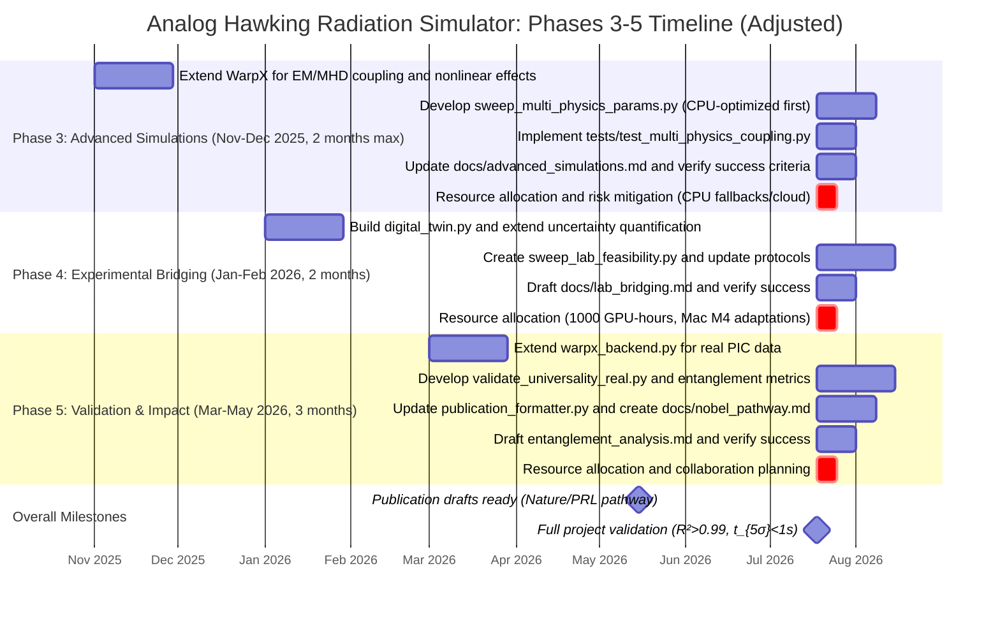

# Project Timeline: Phases 3-5 (Adjusted for Desktop Constraints)

## Adjustments
- Phase 3 shortened to 2 months maximum (Nov-Dec 2025) due to Mac M4 desktop limitations.
- Prioritize CPU-optimized parameter sweeps (e.g., using NumPy/SciPy for initial validations, Metal acceleration where available, cloud bursts for GPU-intensive parts).
- Total timeline remains ~7 months, with potential extensions for Phases 4-5 if needed.

## Gantt Chart



## Dependencies Diagram

```mermaid
graph TD
    A[Current Phases 1-2: Basic Simulations] --> B[Phase 3: Advanced Simulations (CPU Focus)]
    B --> C[Phase 4: Experimental Bridging]
    C --> D[Phase 5: Validation & Impact]

    B1[Extend warpx_backend.py] --> B2[nonlinear_plasma.py]
    B2 --> B3[sweep_multi_physics_params.py (CPU-optimized sweeps)]
    B3 --> B4[tests/test_multi_physics_coupling.py]
    B4 --> E[Success: R²>0.98, κ<3%]

    C1[digital_twin.py] --> C2[monte_carlo_horizon_uncertainty.py extension]
    C2 --> C3[sweep_lab_feasibility.py]
    C3 --> F[Success: <20% uncertainty on T_H]

    D1[warpx_backend.py for PIC data] --> D2[validate_universality_real.py]
    D2 --> D3[entanglement_analysis.md]
    D3 --> D4[publication_formatter.py updates]
    D4 --> G[Success: R²>0.99, drafts ready]

    E --> H[GPU Resources: 5000h Phase 3 (CPU first, cloud for heavy)]
    F --> I[GPU Resources: 1000h Phase 4]
    G --> J[GPU Resources: 2000h Phase 5]
    H --> K[Mac M4 Adaptations: Metal/CPU Fallbacks/Cloud Bursts]
    I --> K
    J --> K

    style A fill:#f9f,stroke:#333
    style E fill:#bbf,stroke:#333
    style F fill:#bbf,stroke:#333
    style G fill:#bbf,stroke:#333
    style K fill:#bfb,stroke:#333
    style B3 fill:#dfd,stroke:#333
```

This adjusted timeline starts in November 2025 and spans approximately 7 months to May 2026. Phase 3 emphasizes CPU-optimized sweeps to mitigate desktop constraints, with cloud integration (e.g., AWS EC2) for GPU-heavy computations. Total estimated GPU-hours: 8000, allocated progressively.
