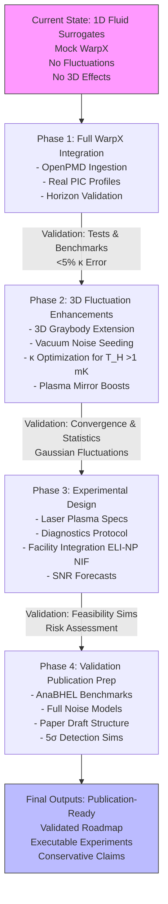

# Workflow Diagram for Phased Upgrade Plan

The following Mermaid diagram visualizes the sequential workflow across the four phases, highlighting key inputs, processes, outputs, and validation gates. Each phase builds on the previous, ensuring incremental progress toward full-fidelity simulations and experimental readiness.

This flowchart illustrates the linear progression with validation checkpoints to maintain rigor. Arrows represent dependencies, and nodes detail core activities per phase.
